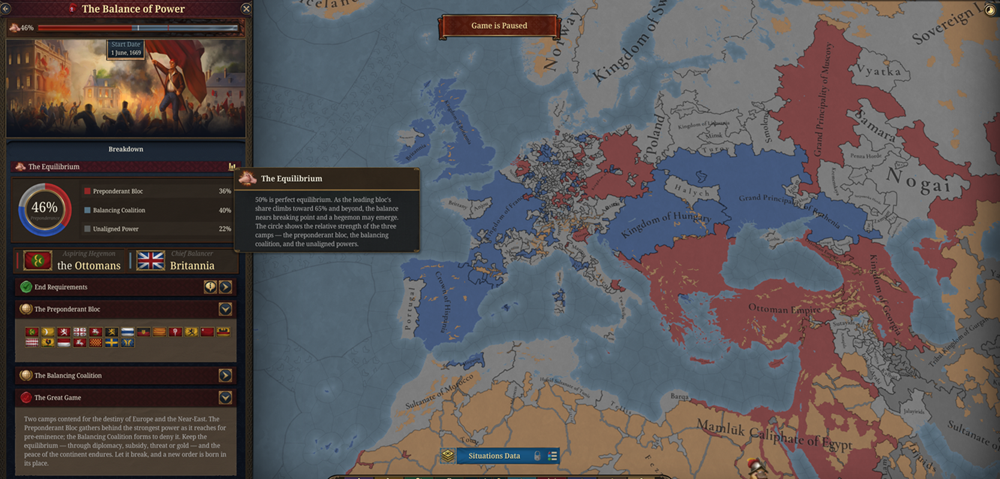
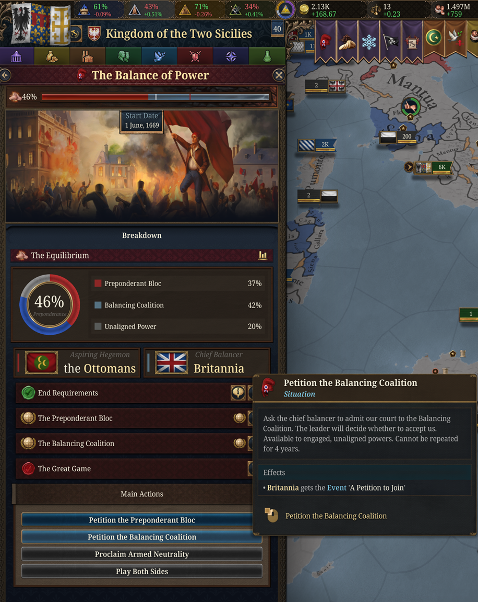
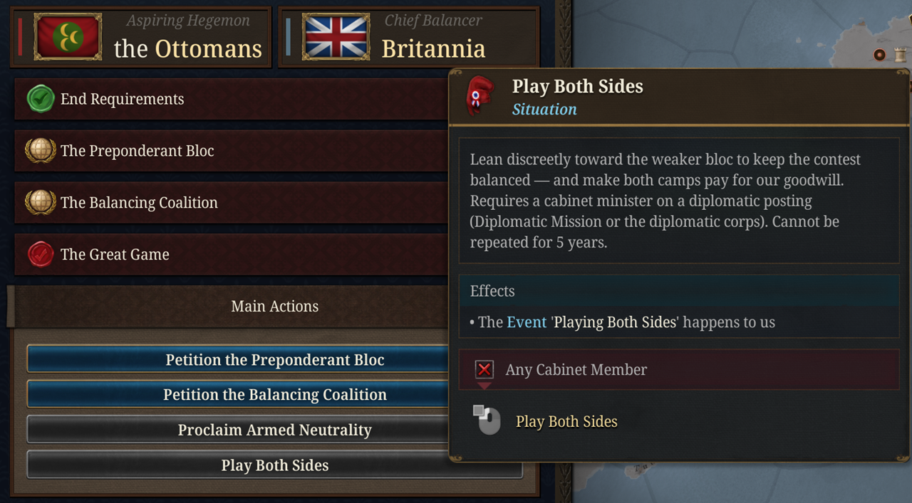
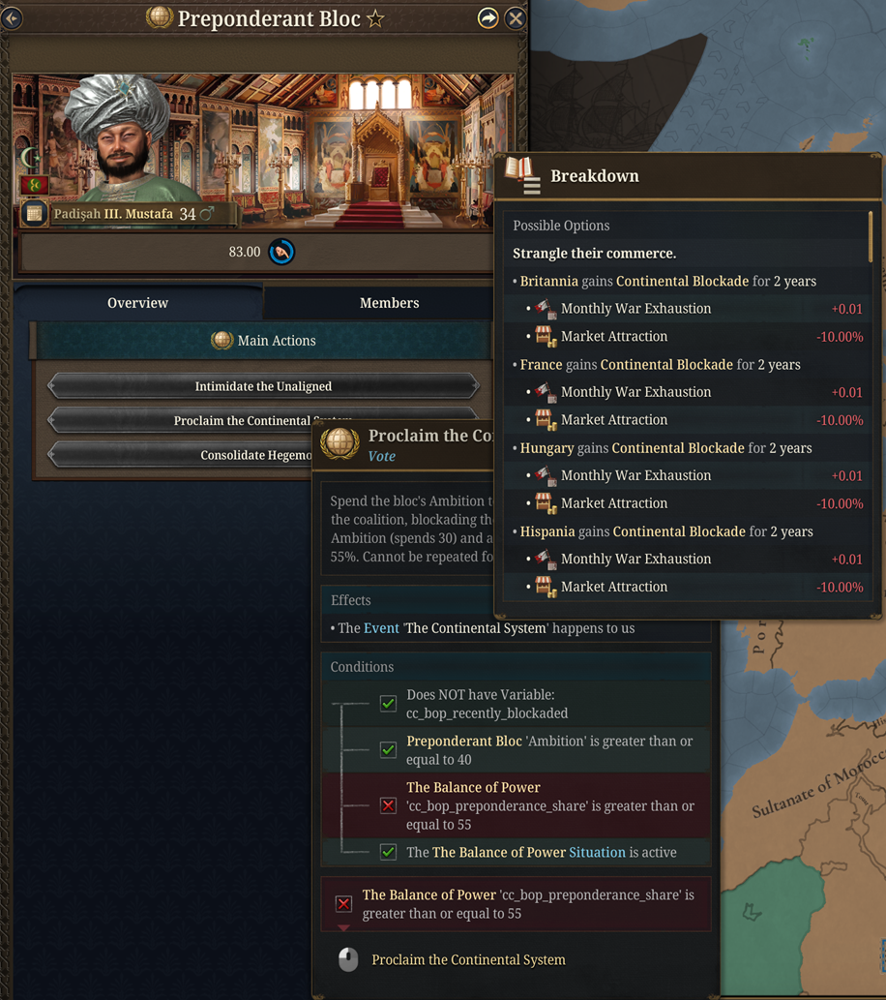
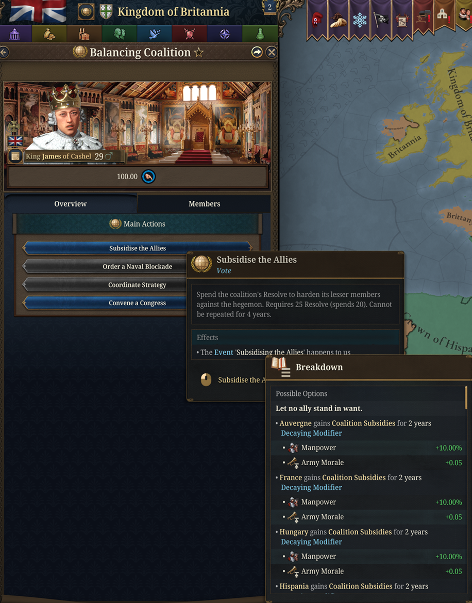
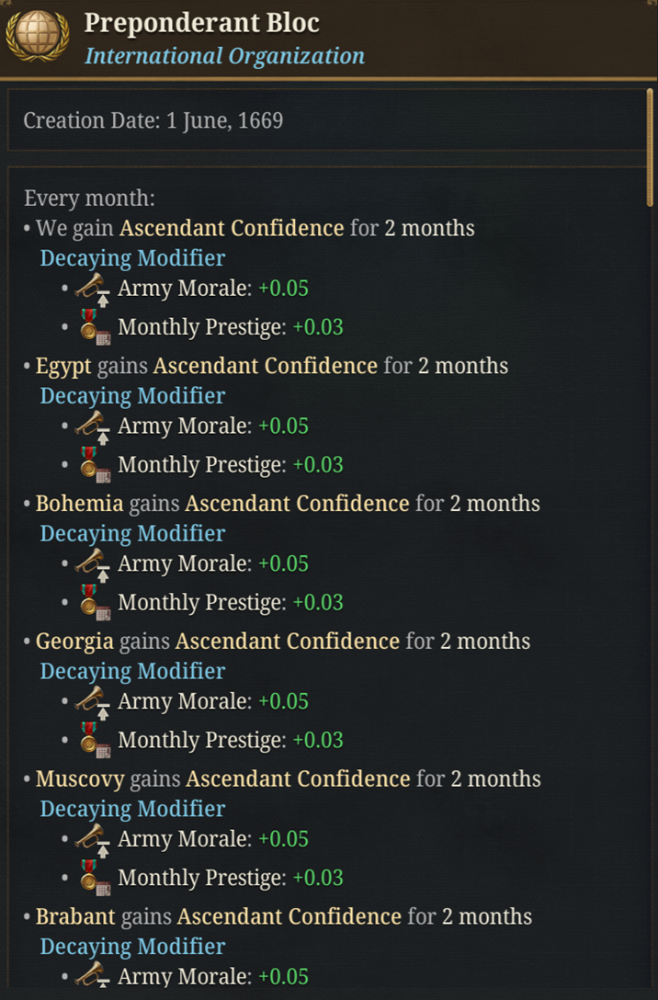
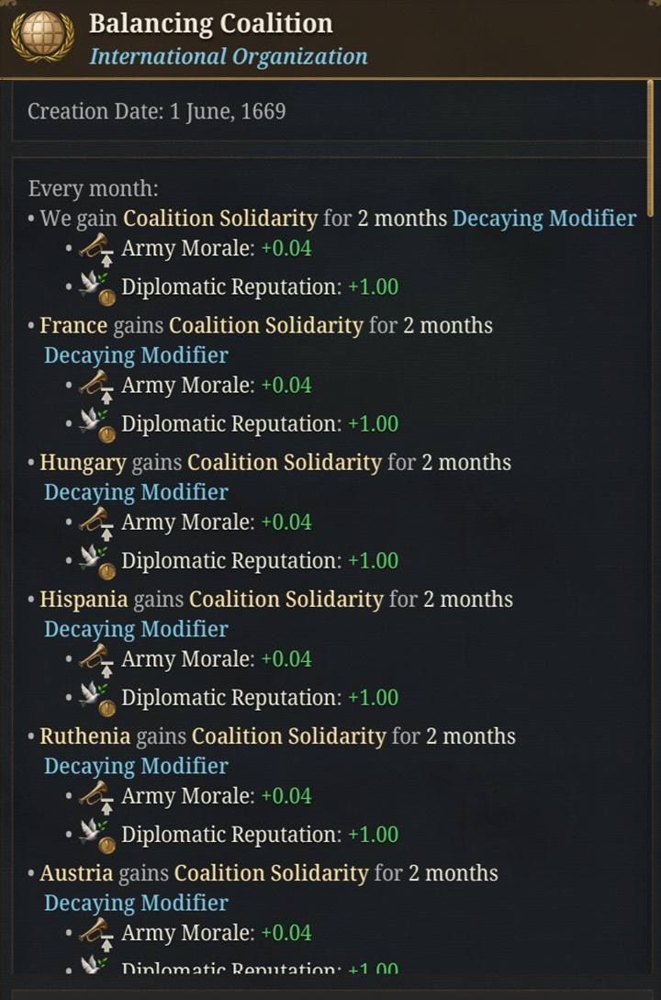
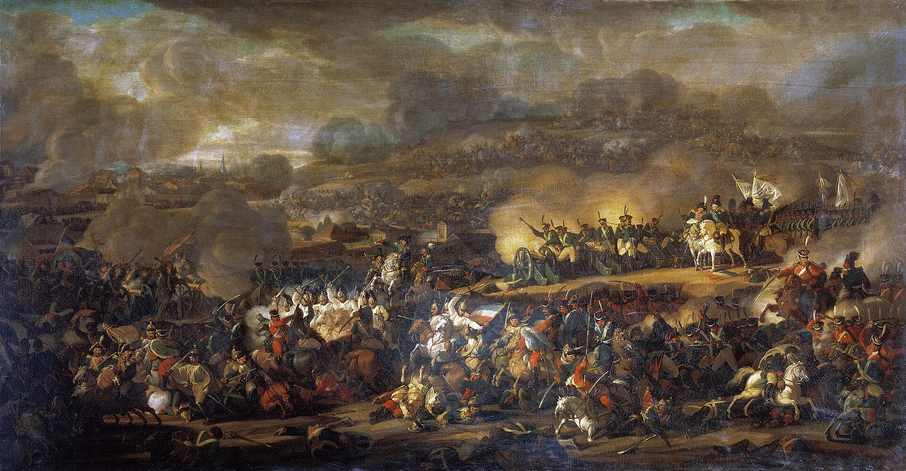

# Dev Diary: The Balance of Power

*An End-game Situation for Flavorium Universalis.*

*Dev Note: I wanted more to do in the end-game European theatre apart from the Revolutions. This situation is meant to be a punishing end-game challenge that simulates European geopolitics of the revolutionary, Napoleonic, and early-Victorian period. See if you can shatter the balance of power or maintain it; either way you are rewarded. The situation can even re-emerge if the balance is threatened again.*

<figure>
  
  <figcaption>The situation panel: the Preponderance Share at the top, the three-way power pie, and the two bloc leaders.</figcaption>
</figure>

For two centuries the chancelleries of Europe played one deadly game: no single crown must ever overtop the rest. Flavorium Universalis brings that game to life as **The Balance of Power**, a continent-spanning situation in which an aspiring hegemon and the coalition that forms to deny it contend for the future of Europe and the Near East.

It begins quietly. Once a great power embraces the **Balance of Power Doctrine** in the Age of Absolutism, or once the revolutionary era opens, the strongest court is cast as the **Preponderant Bloc**, and the strongest power that fears it rises to lead the **Balancing Coalition**. Every eligible court must decide which way to lean.

---

## How it plays

The core of the situation is a single number: the **Preponderance Share**, running from 0 to 100, where 50 is equilibrium. It's the real balance of the two blocs - and only a small and decaying adjustment value for some special events... Bring a great power into your camp and the scale tips; lose your armies and it tips back.

As the leading bloc's share climbs past 65, the balance nears breaking point, and a hegemon may emerge. The tension lies in the struggle over those few points in the middle.

You influence them through play, not menus:

- **Choosing sides.** Both camps court the unaligned, drawing on kinship, shared faith, fear, threats, or gold. A minister kept on *Free Hands* stands for the court that keeps its options open, courted by both and beholden to neither.
- **The balancer's levers.** As chief balancer you can subsidise a faltering partner, court a neutral into the fold, or convene a **Congress** to close ranks and stiffen the coalition's resolve.
- **The hegemon's reach.** As the aspiring power you can lean on weaker neighbours, buy their neutrality, bind them by marriage, or set one of your own kin upon a satellite throne.

Your cabinet matters here. A *Diplomatic Mission* minister draws the great game toward your court; a *War Council* minister presses every military advantage; a war-hawk or a recognised **Master Balancer** can turn a close-run event into a decisive one.

---

## Taking a hand in the game

The balance is not something to watch tick by. Every court can reach into it directly through actions in the situation panel and the bloc's organisation view.

### The unaligned

Courts that have not yet committed can petition their way into a bloc, or make a virtue of standing apart.

  <figure>
    
    <figcaption>An unaligned court petitions a bloc to join. The leader decides whether to admit it.</figcaption>
  </figure>
  <figure>
    
    <figcaption>Playing both sides: leaning toward the weaker bloc to keep the contest finely balanced, and making both camps pay for the privilege.</figcaption>
  </figure>

- **Petition a bloc:** ask the aspiring hegemon or the chief balancer to admit you. The leader decides; a friendly disposition (or a frightening Preponderance Share) makes acceptance more likely.
- **Proclaim Armed Neutrality:** keep your hands free and let foreign gold flow to keep you so. Requires a minister on the **Free Hands** duty.
- **Play Both Sides:** lean discreetly toward the weaker bloc and make both camps pay for your goodwill. Requires a diplomat at work: your **Diplomatic Mission** or a vanilla diplomatic corps.

### The bloc leaders

Each bloc accumulates a currency of its cause (**Ambition** for the Preponderant Bloc, **Resolve** for the Balancing Coalition) that its leader spends on bold measures from the organisation view, reachable from the new icon on each bloc's card in the situation panel.

  <figure>
    
    <figcaption>As the aspiring hegemon, spending Ambition to proclaim the Continental System and blockade the coalition's commerce.</figcaption>
  </figure>
  <figure>
    
    <figcaption>As the chief balancer, spending Resolve to subsidise the coalition's lesser members and harden them against the hegemon.</figcaption>
  </figure>

- The hegemon can **Intimidate the Unaligned**, proclaim the **Continental System** once dominant, or, with a great store of Ambition, **Consolidate Hegemony** for a hard swing of the balance.
- The balancer can **Subsidise the Allies**, order a **Naval Blockade** in answer to the Continental System, **Coordinate Strategy** to drag the balance back toward equilibrium, or **Convene a Congress** to close ranks decisively.

Non-leader members may always **leave their bloc**, at the price of being branded a defector.

### The currencies also speak for themselves

Ambition and Resolve are not only spent on actions; they colour the whole situation. A confident, ambitious bloc presses its event opportunities harder, while a resolute coalition reaps a passive monthly bonus and reaches more readily for the means to redress the scale.

  <figure>
    
    <figcaption>High Ambition emboldens the whole Preponderant Bloc with a monthly confidence modifier.</figcaption>
  </figure>
  <figure>
    
    <figcaption>A resolute coalition earns a monthly solidarity modifier, and wavers when its Resolve runs low.</figcaption>
  </figure>

---

## Betrayal and the reversal of alliances

Rare, high-impact special events turn the whole contest on a single act of treachery. They hinge on a bloc's currency and the character of the minister at court.

- **The Reversal of Alliances:** a wavering member, its bloc faltering and a scheming minister whispering at court, can cross over to the enemy entirely. This swings the balance hard and earns the lasting enmity of those it abandons. A recognised **Master Balancer** holds wavering allies to their word; a *court schemer*, *cynical courtier*, or *corrupted official* makes treachery far likelier.
- **A Purchased Treason:** a leader flush with Ambition or Resolve, served by a cunning minister, can spend that currency and a sack of gold to buy the defection of an enemy member outright.

These echo the real reversals of the age, such as the Diplomatic Revolution of 1756 and Saxony changing sides at Leipzig in 1813, where a single court's betrayal could remake the map.

---

## The historical inspiration

<figure>
  
  <figcaption>The Battle of the Nations at Leipzig, 1813: the great convergence that broke a bid for mastery.</figcaption>
</figure>

The feature takes its shape from the wars of the coalitions against Napoleon, the last and greatest test of the European balance in this era. Its events echo the real turning points of that struggle:

- **The Continental System:** close the markets of the continent against your rival's commerce, and watch the blockade bite both ways.
- **The Bleeding Ulcer:** a national insurrection that drains an occupying hegemon by a thousand small wounds, as Spain bled France.
- **Scorched Earth:** burn the land and fall back into the cold and the distance, until the great host starves amid the ashes, as Russia did in 1812.
- **Levée en Masse:** summon the whole nation to arms, raising vast armies at a cost to the old order.
- **A Separate Peace:** the secret terms offered to a weary partner, as at Tilsit, that the coalition would name betrayal.
- **The Battle of the Nations:** the moment the hosts converge and the bid for mastery may break, as at Leipzig.

Over it all hangs the memory of the **Congress of Vienna**, the settlement that ended the wars and tried to make the balance permanent.

---

## How it can end

The situation resolves in one of four ways, and not all of them are defeats:

- **Hegemony:** one power masters the continent. Glory for the victor, and a long humiliation for those who failed to stop it. A decisive, permanent break.
- **The Eastern Deluge:** an eastern power surges westward and overwhelms the old western order.
- **Revolutionary Collapse:** the careful equilibrium of kings counts for nothing once the people rise.
- **The Concert of Europe:** the equilibrium endures, with congress and compromise maturing into a lasting diplomatic order.

The first three are final; the question is settled for good. The **Concert is different**. Even a well-managed peace eventually frays, so a concert may, a generation later, give way to a *new* balance with fresh poles and fresh ambitions. The peace was never going to last forever.

---

*The Balance of Power can be toggled in the game-rule screen and arrives once a great power adopts the doctrine, or once the revolutionary era opens.*
