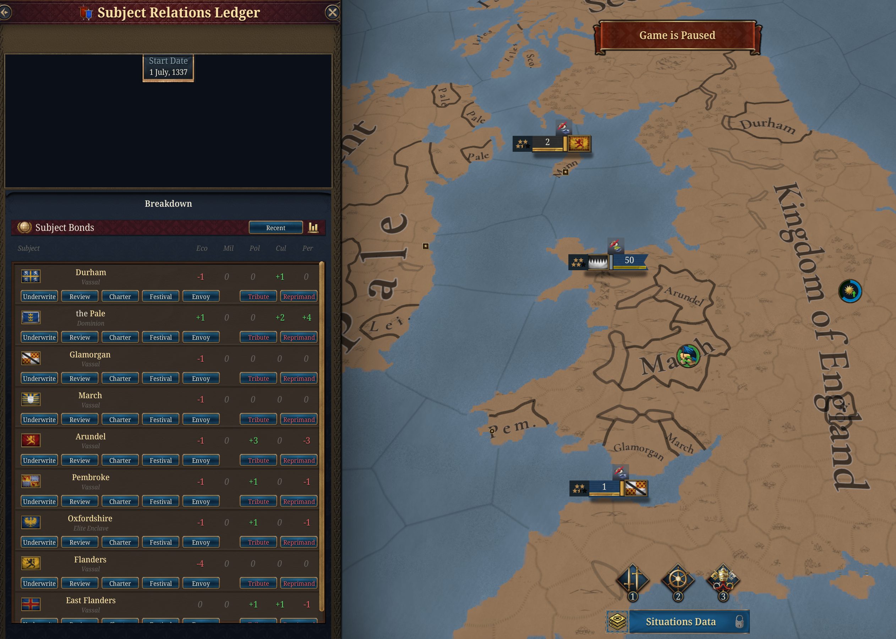
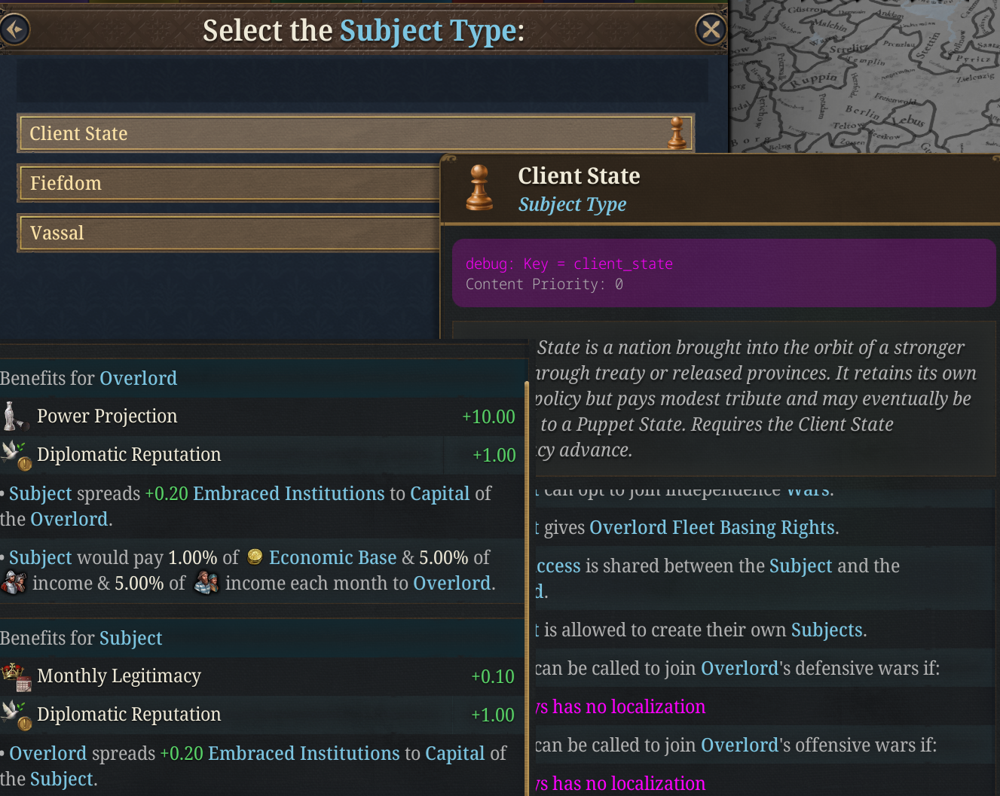
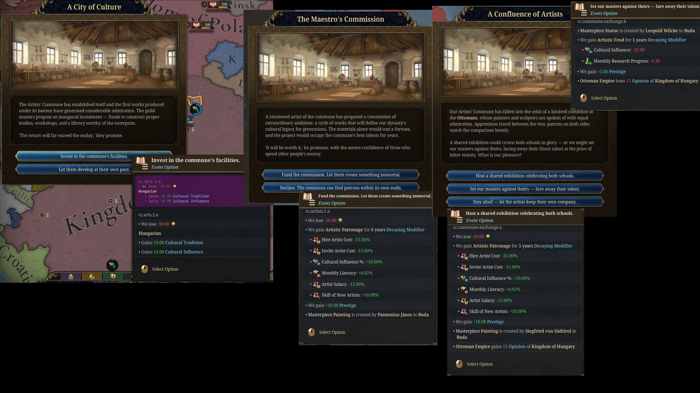
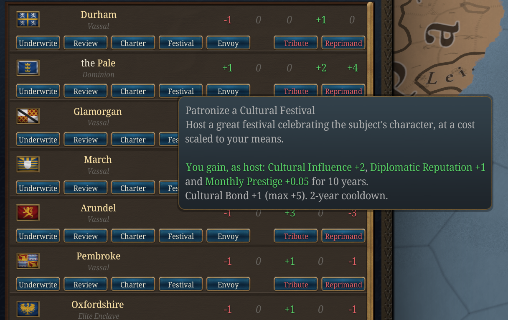
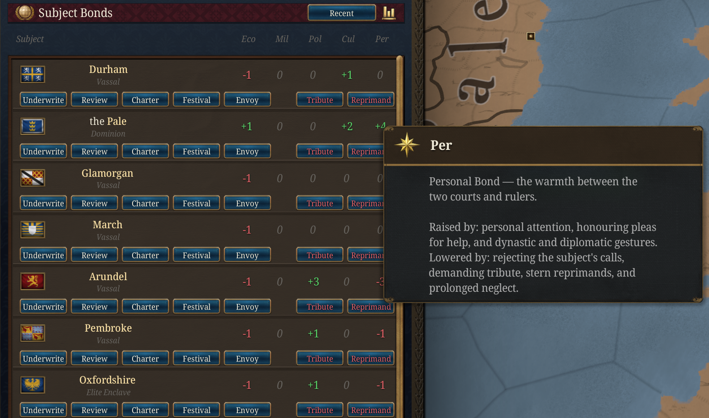
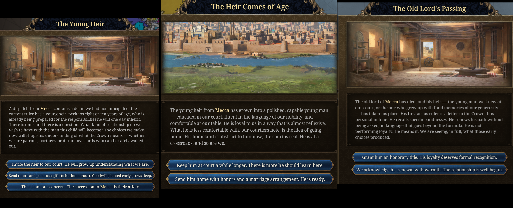
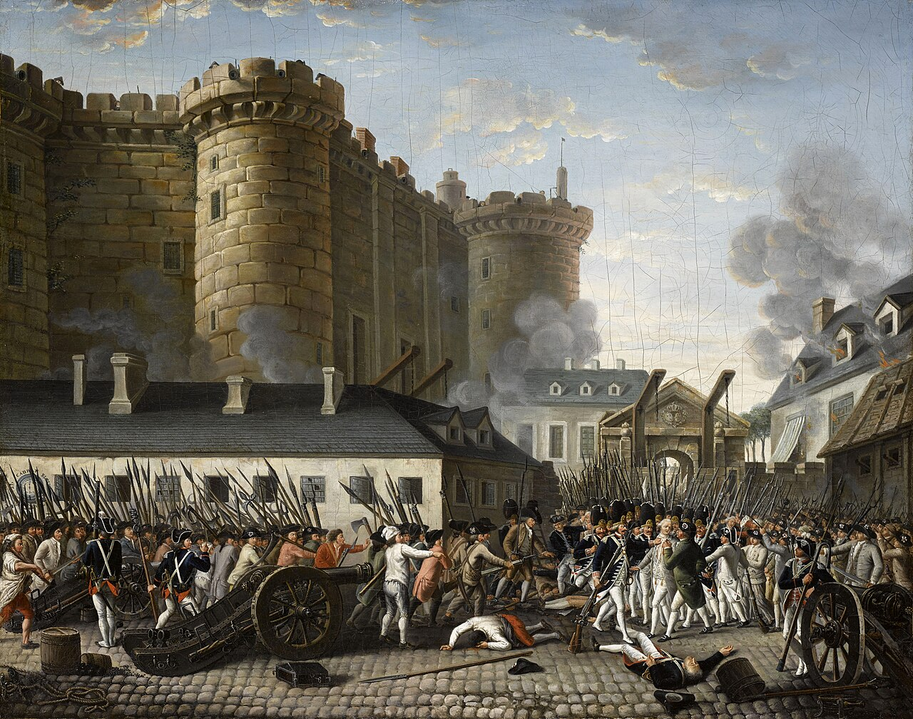

# Dev Diary: Subjects, and the Reckoning

*Published: 2026-08-14*

*Eighteen ways to hold a subject, five ways to be remembered for it, and the age that settles the account.*

*Dev Note: vanilla subjects are a number you manage. You watch liberty desire, you feed it a modifier, you move on. Nothing that happens between you and a vassal in 1490 has any bearing on what happens in 1790. This update is about closing that gap. Your subjects now keep a record, the record covers specific things you did rather than a running total, and in the Age of Revolutions they hand you the bill. This diary covers the whole system: the subject types you can build, the ledger that tracks them, and the two very different late games that come out the other end.*

<figure>
  
  <figcaption>The Subject Relations Ledger: every tracked subject, scored along five lines, with the date the relationship began.</figcaption>
</figure>

---

## Eighteen ways to hold a subject

Vanilla gives you vassals, marches, and colonies. Flavorium adds eighteen more arrangements, unlocked by advances across the ages, and most of them exist because they enable a playstyle rather than because a chart had a gap in it.

Some are quiet influence. A **Shadow State** is independent on paper and bound by private treaty in practice; promote it to a **Client State**, then a **Puppet State**, and you have a slow ladder from "we have an understanding" to "we appoint their ministers" that never once required you to declare war. If you have played Victoria 3, you will recognise the shape.

Some are prestige projects that actually produce something. An **Artists' Commune** does not just sit there generating a modifier: its events place real works of art in your capital, credited to a court artist if you have one. A **Scientific College** does the same with treatises. Grant an **Elite Enclave** to a kindred noble house and let it mature into a **Palatinate**, and the lord's finest knight can end up commanding your armies as a named character.

Some are frankly exploitative, and the mod does not pretend otherwise. A **Tax Farm** hands revenue collection to a powerful lord who keeps a cut. A **Chartered Company** runs your commerce in distant lands on terms that favour you. These work. They are also exactly the arrangements that produce the worst reckonings two centuries later, and that tension is the point.

  <figure>
    
    <figcaption>The expanded subject roster. Most types need a matching advance, and several want an estate privilege or government reform as well.</figcaption>
  </figure>
  <figure>
    
    <figcaption>An Artists' Commune delivering an actual work of art to the capital, attributed to a minister at court.</figcaption>
  </figure>

---

## The ledger

Every significant subject keeps an account with you, scored from -5 to +5 along five lines:

- **Economic:** whether you invest in them or strip them.
- **Military:** whether you spend their soldiers carelessly, and whether you come when they call.
- **Political:** how much say you let them have.
- **Cultural:** whether they are allowed to remain themselves.
- **Personal:** the warmth between the two courts, across generations of rulers.

These move on their own as you play. Building in their lands, sharing institutions, subsidising their treasury, answering their pleas for help: all of it registers without you doing anything deliberate. So does the opposite. Call a subject into four wars a decade and the military line sags. Convert them by force and the cultural line collapses.

You can also tend a relationship directly. Each subject has a row of actions on a shared cooldown: **Underwrite** their treasury, hold a joint **Review**, confer a **Charter** of privileges, patronise a **Festival**, dispatch a personal **Envoy**. Each costs something real and each buys a point on one line. Two of them run the other way: **Tribute** takes their money and their goodwill, and **Reprimand** buys compliance at the cost of warmth.

  <figure>
    
    <figcaption>The actions under each subject. Generosity is not free, and the cheap options cost you elsewhere.</figcaption>
  </figure>
  <figure>
    
    <figcaption>Hovering a score tells you exactly what raises and lowers it, so no part of the account is hidden from you.</figcaption>
  </figure>

There is a second layer underneath. Alongside the current score, each bond keeps a **lifetime memory**: every few generations the present standing is folded into a long-term average and then half-forgotten. A relationship you repaired last decade still carries the century that came before it. The panel has a toggle so you can look at either, and the lifetime figure is the one that matters most when the reckoning arrives.

---

## What they actually remember

This is the part that changed most in this update.

A running total is a blunt instrument. It tells a colony it is unhappy; it does not tell it *why*. So alongside the scores, your subjects now remember around thirty **specific decisions**, and the endgame reads them.

Did you grant that colony an assembly when it asked for a voice, or refuse? Did you fund the frontier fortress, or leave the march lord to pay for his own walls? When you brought his heir to your court, did the boy go home loyal or go home hating you? Did you sponsor the brilliant local scholar, put him on your payroll as a propagandist, or have him silenced? Did you force a conversion on a people who had already stopped trusting you?

Each of those is filed away, and each surfaces later, both in what the endgame event *says* and in what it *does*. A colony in revolt reads very differently when the pamphlets driving it are being written by the scholar you had suppressed forty years earlier. A frontier that holds against everything reads differently when the reason it holds is a fortress you paid for in 1602.

<figure>
  
  <figcaption>A march lord's heir arrives at court. How you raise him is remembered for the rest of the game, and decides which side he is on at the end of it.</figcaption>
</figure>

---

## The reckoning

Then the Age of Revolutions opens, and the account comes due.

Each tracked relationship resolves into a one-shot event, and how heavy that event lands depends on the weight of the record: a merely good relationship produces a local, proportionate outcome, while an exceptional one changes the map. Banked goodwill can soften a bad ending by a full step, and accumulated grievance can push a mediocre one over the edge. A subject that has taken the field against you three times does not get a quiet ending regardless of how the numbers look now.

They arrive one at a time across the age, worst relationships first, so each one lands as its own set piece rather than as a wall of popups the year the age ticks over.

The important change is that these outcomes now reach into the revolution itself.

**If your subjects stand with you**, that loyalty is worth something concrete at home. Their steadiness feeds your estates and your stability, and the deepest bonds will hold the revolutionary crisis off your own realm outright for a generation, and mark your court as the crown that held while others fell. Two centuries of paying attention to a colonial assembly turn out to be the cheapest insurance policy you ever bought.

**If they do not**, the argument travels. An estranged subject makes the revolution substantially likelier to break out in *your* capital, not just theirs. The very worst relationships put sympathisers on your own streets while you are still trying to deal with the original problem.

  <figure>
    
    <figcaption>A colony that was given a voice, sitting out the age. The assembly you chartered is where the argument is happening, which is why you are reading a transcript instead of a casualty list.</figcaption>
  </figure>
  <figure>
    
    <figcaption>The other version. You can crack down, concede everything you should have conceded decades ago, or let them go before the argument crosses the ocean.</figcaption>
  </figure>

---

## Two roads out

The reckoning is not simply pass or fail. It opens two genuinely different late games.

### The federation

Take **Colonial Assemblies**, then a **Federal Constitution**, and your empire acquires a ladder. A well-treated subject can be raised to an **Imperial Council Member**, then an **Associate Member**, then a full **Federal Member** with a real seat. A colony that has been dealt with honestly for two centuries will come to you in the revolutionary age and *ask* for federation, having already considered independence and rejected it on the merits.

Played to its end, this is an empire that survives the age by ceasing to be an empire: a union of partners that holds together because the people inside it have somewhere to make their argument. Your council members will spend the crisis holding the thing together on your behalf.

There is a darker version, and it is available to you from the same advance tree. The **Federal Charter** lets you brand a client as a federal partner while continuing to extract from it exactly as before. It pays well and immediately. It also means that when someone in that subject finally sits down and compares the charter you signed against what actually happened, they will read the whole document aloud, clause by clause, in front of every other court you have ever signed anything with. You can still save it at that point. It will cost you a great deal more than honesty would have.

### The revolution

The other road is more fun to watch and considerably worse to live through.

A **Military March** is an offensive border vassal: trained soldiers, your drill, your staff work, intimate knowledge of your frontier. Treat one badly for long enough and it does not merely defect. The march lord raises his own banner, and if the relationship has rotted far enough you are given the option to cut him loose entirely and let the age have him. Take it, and a revolutionary republic appears on your border, fielding the army you trained, commanded by the officer you educated.

Elsewhere: a **Palatinate** can declare armed neutrality and simply write you out of its calculations, which is somehow worse than rebellion. A **Crown Dependency** can send you a courteous letter explaining that it has been approached by a neighbouring power and is exploring its options. A **Provincial Governorate** can reach the point where you hold it by garrison or not at all.

And if enough of this is happening at once while the continent is already contested, it feeds the **Balance of Power** situation's Revolutionary Collapse ending, where the careful equilibrium of kings turns out to count for nothing once the people rise.

<figure>
  
  <figcaption>The march lord raises his own banner. The option to release him as a revolutionary state is only offered when the relationship has gone past saving.</figcaption>
</figure>

---

## The historical inspiration

  <figure>
    
    <figcaption>The Storming of the Bastille, 1789. The age that decides whether your empire was a partnership or an arrangement.</figcaption>
  </figure>
  <figure>
    
    <figcaption>The other outcome: colonies that argued their way into a union instead of out of one.</figcaption>
  </figure>

The system takes its shape from the long imperial unravelling between roughly 1770 and 1830, and from the fact that it did not go the same way everywhere.

Thirteen colonies with assemblies, a tax dispute and no representation broke away and wrote a federal constitution. Spanish America, governed for three centuries by appointed peninsulars with almost no local voice, broke away far more violently and stayed broken. Canada did not leave at all. The difference was rarely the size of the grievance. It was whether there had ever been a legitimate place to put it.

That is the argument the whole system is built around. The subjects that stay with you are not the ones you taxed least. They are the ones you gave somewhere to complain.

---

*The Subject Relations Ledger, its chain events, and the Age of Revolutions payoffs are all governed by the **C&C: Overlord-Subject Bonds** game rule (default: on). The federal and revolutionary paths need their matching advances, which sit in the late Diplomatic and Administrative branches.*
